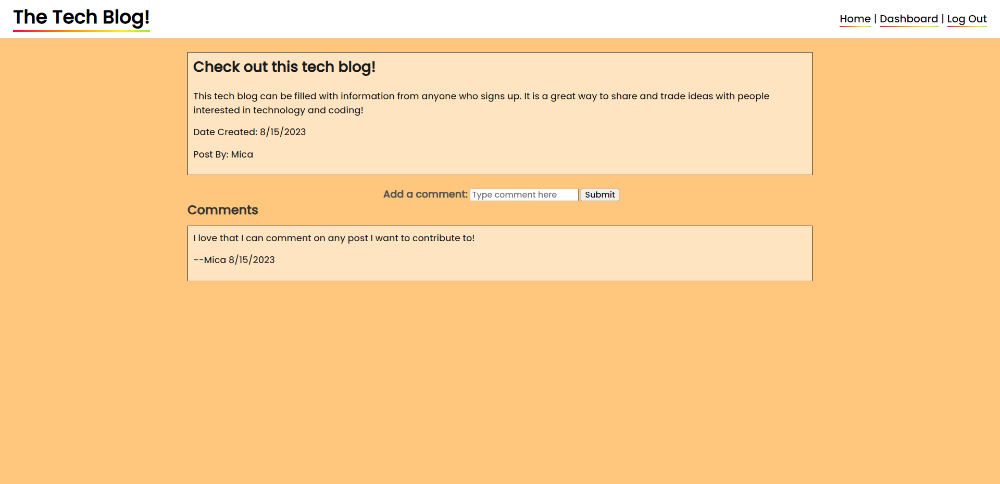

# Tech-Blog

## Description
This CMS-style blog application was built to host ideas and topics regarding technology. Developers can publish their own blog posts and comment on other developers' posts as well. When a user first visits the site, the homepage displays any existing blog posts along with a navigation bar in which they can be redirected to the login page. If they have not yet created an account, there is a link at the bottom of the login form which will take them to the signup page. Once successfully signed up or logged in, the user will be redirected to their dashboard which allows them to create new posts or interact with their existing blog posts. They have the option to update any existing blog post in an edit page or to delete a post altogether. Every post a user creates will be displayed on the homepage where blog posts from all users live. Each existing user has the ability to open a blog post and leave a comment under it. If someone does not have an account or is not logged in, they will not be able to leave any comments nor have access to a dashboard. Users can come back to the site at any time and log in using the same information they signed up with to gain access to these features again.

## Credit
Thank you to my classmates; May Pham, Joey Lee, Lucas Wysoczanski, and Daniel Lee; for partnering with me to work on this challenge. Here are their GitHub profiles-- May Pham: https://github.com/mayphamx Joey Lee: https://github.com/Rockojoe2 Lucas Wysoczanski: https://github.com/LucasWyski001 Daniel Lee: https://github.com/drog41813

## License
This repository is licensed by MIT. See https://mit-license.org/ to learn more.

## Usage
Visit the tech blog here: https://micaella-tech-blog-59909c752750.herokuapp.com/

